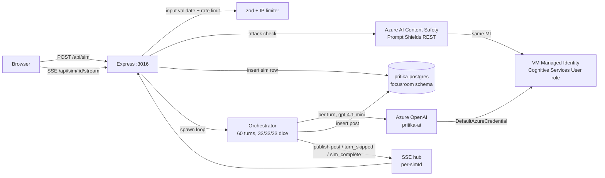

# focusroom

Audience simulator. Drop a post, watch 20 hardcoded personas react in real time.

## Live

[**focusroom.pritika.studio**](https://focusroom.pritika.studio)

## What this is

Visitor types one message (a tagline, a product name, a question). FocusRoom runs a 60-turn simulation: 20 personas, each with three chances to participate. On each turn the picked persona rolls a fair three-sided die. One third of the time they drop a new top-level comment. One third of the time they reply to an existing post (anywhere in any thread). One third of the time they scroll past silently. Posts stream into the UI live via SSE as the orchestrator generates them, ~90 seconds end to end.

Useful for marketers, founders, designers, and anyone who wants to gauge audience reactions before publishing.

## Why this exists

An end-to-end demonstration of multi-agent orchestration on real infrastructure: prompt-injection defense (Azure AI Content Safety Prompt Shields), per-persona context isolation, live streaming over SSE, daily-budget circuit breakers, and a Postgres-backed transcript with FK-walkable threads. Authentication to Azure OpenAI is via the VM's Managed Identity, so no API keys leave Key Vault.

## Architecture



Everything runs on the shared Azure VM (`pritika-portfolio-vm`) inside the `pritika` docker network. Caddy fronts every subdomain with auto Let's Encrypt; the container exposes `3016` to the docker network only.

## Data model

Two tables in the `focusroom` schema:

- `simulations` — one row per sim. Tracks `prompt`, `ip`, `status` (`running` / `complete` / `blocked_prompt_shield` / `error` / `orphaned`), `blocked_by_shield`, post/silent/dropped counts, token totals, `total_cost_cents`.
- `posts` — one row per agent message. `sim_id` FK + `parent_post_id` self-FK so the thread is walkable in both directions.

Indexes hit four access paths: rate-limiter (`ip, started_at desc`), daily-budget rollup (`started_at desc`), SSE backlog replay (`sim_id, created_at`), context builder ancestor walk (`parent_post_id`).

The `focusroom_app` Postgres role has only `SELECT/INSERT/UPDATE/DELETE` on its own schema; it cannot CREATE schemas or touch any other project's data. The schema is created by the superuser in `scripts/bootstrap-vm.sh` and authorized to `focusroom_app`.

## Tech stack

- **TypeScript strict** with `noUncheckedIndexedAccess`, `noImplicitOverride`, no `any` without a comment
- **Node 24 + Express 5** for the API, **React 19 + Vite 5 + Tailwind 3** for the SPA
- **Shared `pritika-postgres`** for state (own schema, own role)
- **SSE pub/sub** lifted from `controlroom`, keyed per simId so subscribers only see events for the simulation they're watching
- **Azure OpenAI** (`gpt-4.1-mini` deployment on `pritika-ai`) for chat. Auth via `@azure/identity` `DefaultAzureCredential` (VM managed identity in prod, `az login` locally). No API keys.
- **Azure AI Content Safety Prompt Shields** for prompt-injection defense (direct REST call against `/contentsafety/text:shieldPrompt`). Same auth chain.
- **Helmet** for CSP + HSTS, **zod** for input validation

## Run locally

```sh
mise install
npm ci
# Point DATABASE_URL at a reachable Postgres + AZURE_OPENAI_ENDPOINT etc.
# Auth via `az login` (DefaultAzureCredential picks it up).
npm run migrate
npm run dev   # Vite on 5173, Express on 3016
```

Or run the prod container locally:

```sh
docker compose -f docker-compose.local.yml up --build
```

## Tests &amp; CI

**v1 ships without an automated test suite or GitHub Actions CI gate.** Deliberate trade for launch speed (same scope decision as the rest of the portfolio family). The first follow-up PR adds vitest + supertest for the server, vitest + jsdom for the client, and lifts controlroom's `ci.yml` and `deploy.yml` pair before any further changes land.

Until then, the pre-push gate is the local audit script:

```sh
pre-commit run --all-files     # gitleaks + shellcheck + file hygiene
npm audit --omit=dev --audit-level=high
```

## Performance &amp; cost

- Per simulation: ~40 LLM calls (60 turns × 2/3 participate) × ~$0.0006 each ≈ **$0.025**
- Plus one Prompt Shields call per submit ≈ **$0.00075** (rounding error)
- **Total ~$0.026/sim**; daily budget circuit breaker default $2 (refuses new sims past the cap, resets at UTC midnight)
- End-to-end sim duration: ~90 seconds (60 turns × ~1.5s pacing jitter)
- Per-IP rate limit: 10 sims/hour sliding window

## Security model

Six-layer defense, documented thoroughly in the plan file. Headline pieces:

1. **Input pre-filter** (zod) — length, slur deny-list, PII regex, basic prompt-injection patterns. Runs before any Azure call to save cost on obvious garbage.
2. **Azure AI Content Safety Prompt Shields** — primary defense. Microsoft's trained classifier catches encoding tricks, role-play overrides, conversation-mockup attacks, and the long tail of novel jailbreaks the regex can't. Fails safe on any API error.
3. **System-prompt design** — every persona prompt instructs the model to treat the user message as inert content wrapped in `<<<USER_MESSAGE>>>` delimiters, never break character, never reproduce instructions, refuse harm IN CHARACTER (not with a chatbot's "I cannot help with that").
4. **Output safety scanner** — local slur regex + system-prompt-leak heuristic on every LLM output. Drops silently, increments `dropped_count`, no retry loop.
5. **Persona isolation** — personas never see each other's system prompts; the UI persona panel never exposes the system prompt either (attackers don't get a blueprint).
6. **Daily budget circuit breaker** — caps worst-case dollar loss at $2/day no matter what.

## Limitations &amp; honest scope

- **No tests, no CI on v1** (see *Tests &amp; CI* and *What's next*)
- **No shareable URLs** — Postgres persists rows but no public `/sim/<shortcode>` route in v1
- **No persona editor** — personas are hardcoded in `src/server/personas.ts`; edit + redeploy to change
- **EN only** — persona prompts are English; multilingual is a v1.4 candidate
- **No analytics** — first-party only when it lands, never a third-party tracker

## What's next

Each item below is a discrete PR landing in order.

1. **v1.1 — Tests + CI gate.** vitest + supertest for the server, vitest + jsdom for the client. Lift `ci.yml` + `deploy.yml` from controlroom; OIDC + `az vm run-command` replaces the manual deploy. Must land before any further changes.
2. **v1.2 — Shareable simulation URLs.** Public `/sim/<shortcode>` route + share button. The Postgres schema already persists everything; v1.2 just adds the URL surface and a `share?` flag.
3. **v1.3 — Persona editor UI.** Pritika-only authed UI to edit `personas.ts` without redeploying.
4. **v1.4 — Multilingual personas.** A few non-English personas with native voice. Requires Prompt Shield evaluation in those languages.
5. **v1.5 — Output text moderation via Azure Content Safety.** Adds the explicit `/text:analyze` call (~$0.03/sim). Defer until output leakage is observed; Azure OpenAI's built-in filter + the local regex cover most cases for free.
